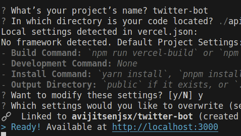

### B0Bot - A Twitter Bot

B0Bot is a Twitter bot that provides periodic hacker, cybersecurity news to the followers of Bug Zero Twitter account. In addition, if a user mentions the Bug Zero Twitter account and ask for certain keywords or news, B0Bot will reply with latest news (on Twitter) with the given keywords.

#### How to use

1. Mention the Bug Zero Twitter account with the keywords you want to search for.
2. B0Bot will reply with the latest news on Twitter with the given keywords.

#### How to run

1. Clone the repository. 
2. Install the requirements.
3. Create a Twitter developer account and get the API keys.
4. Create a .env file and add the following keys:
    - CONSUMER_KEY
    - CONSUMER_SECRET
    - ACCESS_TOKEN
    - ACCESS_TOKEN_SECRET
5. Run the app.py file.

### License

This project is licensed under the MIT License - see the LICENSE.md file for details

### Acknowledgments

- [Twitter API](https://developer.twitter.com/en/docs)
- [News API](https://newsapi.org/)
- [Python](https://www.python.org/)
- [vercel](https://vercel.com/)
- [RSS Feed](https://www.rss.com/)

### Project Documentation

### Running on serverless

